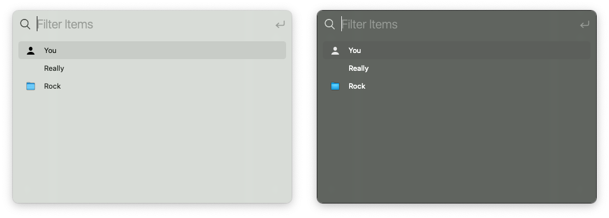

# FloatingFilter


[](https://github.com/Carthage/Carthage)

Display things in an app-modal floating window that users can fuzzy-filter by typing ahead.



## Usage

This module strives for taking care of its components's memory wherever possible. This means you do not need to keep a reference to the window or its controller around. **Both will be freed when the action has been completed.**

### When all possible items are known

This is useful if you want to filter e.g. a limited collection of files, like "Recent Files", or to display a lsit of known macros.


```swift
import FloatingFilter

// ... 

let items = [
    Item(identifier: UUID(),          title: "Create new widget"),
    Item(identifier: 202002200930,    title: "Open last document"),
    Item(identifier: "custom-ID_123", title: "Show downloaded data")
]


FloatingFilterModule.showFilterWindow(items: items) { selectedItems in
    print("Selected:", selectedItems.map { $0.title })
}
```


## Installation

### Carthage

Add this to your `Cartfile`:

    github "cleancocoa/FloatingFilter"

Then run 

    $ carthage update

... and include `FloatingFilter.framework` from `Carthage/Build/Mac` in your app. 

## License

Copyright (c) 2020 Christian Tietze. Distributed under the MIT License.

Fuzzy matching is Copyright (c) 2015 Yichi Zhang <https://github.com/yichizhang/SwiftyStringScore>
